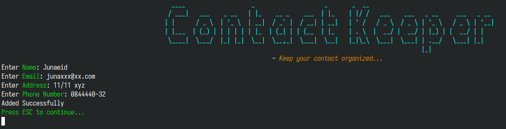
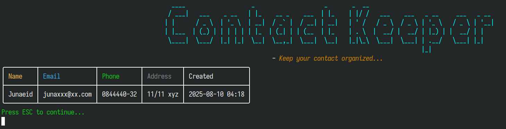

# Contact Keeper
#### *- Keep your contact organized...*

---------------

### Tech
- .NET(v8.0).
- [Spectre.Console](https://spectreconsole.net)
- Microsoft Entity Framework.
- MSSQL

### Features

- Keyboard Based Navigation.
  

- Easier selection based Menu & Strucuted Contact Summary.
  
  
  

- Custom Validation for Email and Phone Number.
  

### Uses.
- #### Clone Repo.
  `git clone https://github.com/devjunaeid/DotNETConsole.DrinksInfo.git`
- #### Create `.env` file in the project root folder.
- #### Set `DB_CONNECTION_STRING` in the `.env`.
- #### Go to the project folder and restore.
    `dotnet restore`
- #### Build.
    `dotnet build`
- #### Migrate Database
    `dotnet ef database update`
- #### Run.
    `dotnet run`
